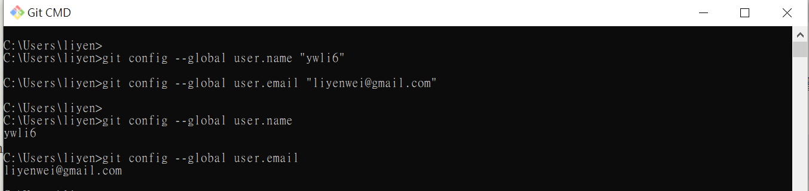
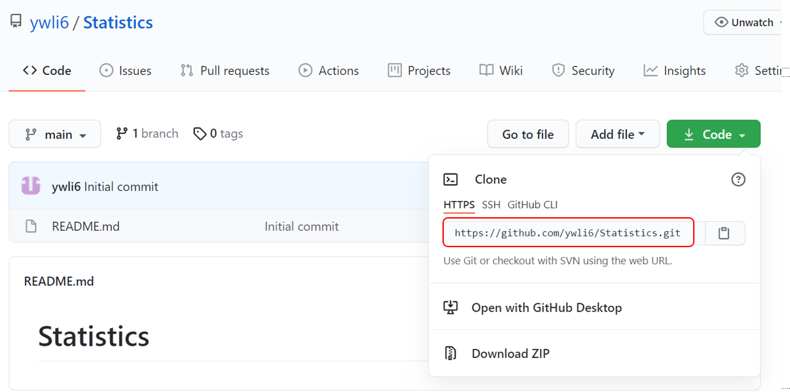
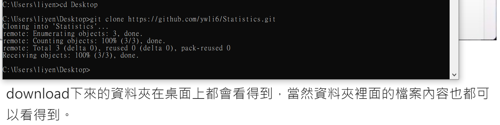
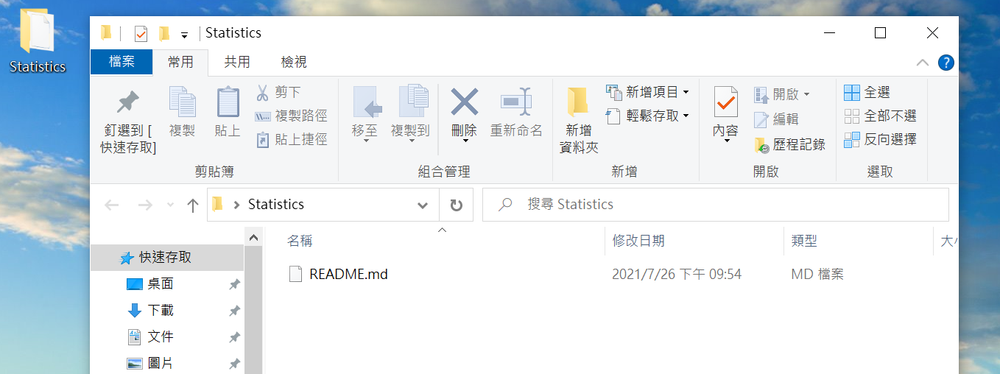
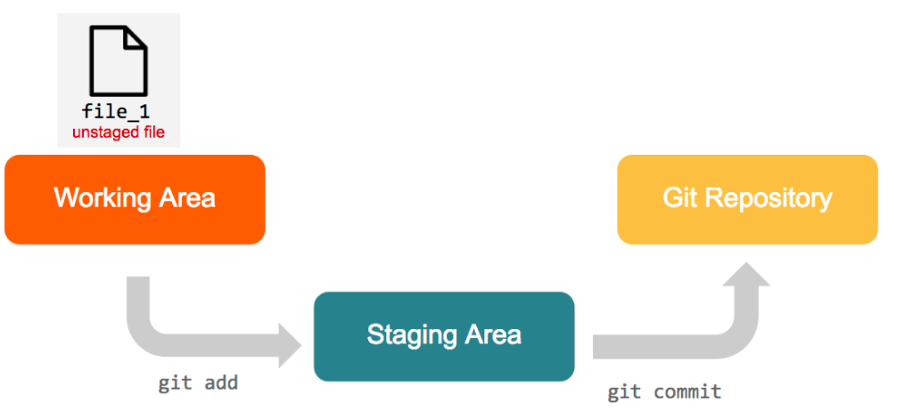
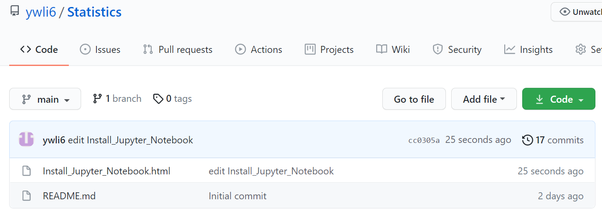

### Github是一個基於　Git　的程式碼託管平臺，可以放置自己原始碼 (Source Code) 的網路空間。
### Git 是什麼？是一種程式版本控制的工具。¶

# 開始使用 GitHub

* 1.註冊GitHub帳號 

  https://github.com/

* 2.在GitHub 網站建立倉庫 Create a new repository 

  https://kingofamani.gitbooks.io/git-teach/content/chapter_5/github.html

* 3.在自己電腦上下載並安裝 git 

    https://gitforwindows.org/  

    Git 安裝說明: 
   
    https://www.itread01.com/content/1549725138.html

* 4.安裝 Git 後，首先應該做的事是在自己電腦上(Git CMD) 設定使用者名稱及電子郵件 

> git config --global user.name "ywli6" \
> git config --global user.email "liyenwei@gmail.com"

  可以輸入以下指令確認是否輸入成功: 

> git config --global user.name \
> git config --global user.email

* 5.Clone Repository 

   在本地電腦上建立一個倉庫Repository的拷貝版本：
   
   a. cd 至本地電腦想放Repository的路徑 (假設是 Desktop(桌面))
   
   > cd Desktop
   
   b. 在 GitHub 網頁內，在 Code 中，點擊「clone or download」將裡面的網址
   

> git clone https://github.com/ywli6/Statistics.git

# 本地端電腦與遠端 GitHub 資料夾版本管理同步

## 將本地電腦儲存庫之程式上傳至 GitHub

* 1.將 file 提交到本地 Git repository 裡

將要上傳的程式放入本地端倉庫中，並將檔案放入 git 中，
這個流程需要兩道指令：git add 與 git commit

#### git add

> git add Install_Jupyter_Notebook.html

若要同時提交許多檔案，可以用

> git add .

git add 後，此時檔案已在 staging area，準備送進 repository。

#### git commit

> git commit -m "edit Install_Jupyter_Notebook"

git add 是把要送出的檔案放到暫存區 ( Stage )中，

執行 git commit 就可以把暫存區 ( Stage ) 裡所有修改的內容送到目前的分支上。

git commit -m "xxxxx" : -m 後面輸入的"xxxxx" 內容是本次修改 ( 送出 ) 的說明，以容易理解此次修改的內容為上，方便以後追蹤。

-m 是 --message 的縮寫，可以為這筆 commit 附上這一筆 commit 的說明。

* 2.從本地端傳送(push)至遠端

   使用 git push 把本地 repository 檔案「推」到遠端 GitHub 中
   
   > git push 

## 將遠端檔案由 GitHub 拉回本機更新

> git pull

## 在本地端刪除檔案

   直接使用 git rm 指令

> git rm Install_Jupyter_Notebook.html

   檢查狀況
   
> git status  

### 刪除本地端檔案後與 GitHub 同步

   git commit file -m "內容任意寫"

 > git commit -i Install_Jupyter_Notebook.html -m "delete file"
 
   輸入 git push 與 GitHub 同步
   
 > git push
 
 GitHub 中 Install_Jupyter_Notebook.html 檔案即消失
 

## 參考網站:

Git-Tutorials 基本使用教學:
https://github.com/twtrubiks/Git-Tutorials

GitHub建立遠端儲存庫:
https://kingofamani.gitbooks.io/git-teach/content/chapter_5/github.html

[Git][教學] 02. 開始使用 GitHub， 註冊與建立repo:
https://progressbar.tw/posts/3

Git與GitHub介紹，軟體版本控制基本教學:
https://tw.alphacamp.co/blog/git-github-version-control-guide

Git 與 GitHub 起手式:
https://medium.com/wenchin-rolls-around/git-%E8%88%87-github-%E8%B5%B7%E6%89%8B%E5%BC%8F-966e18da84f2

Github 簡明教程:
https://codertw.com/%E4%BC%BA%E6%9C%8D%E5%99%A8/142825/

使用 GitHub 免費製作個人網站:
https://gitbook.tw/chapters/github/using-github-pages.html

