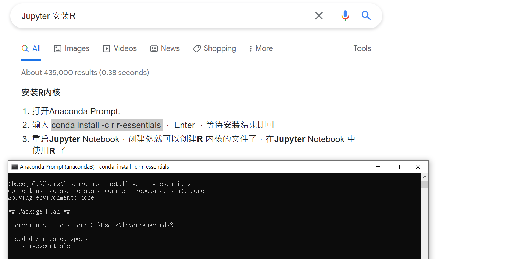
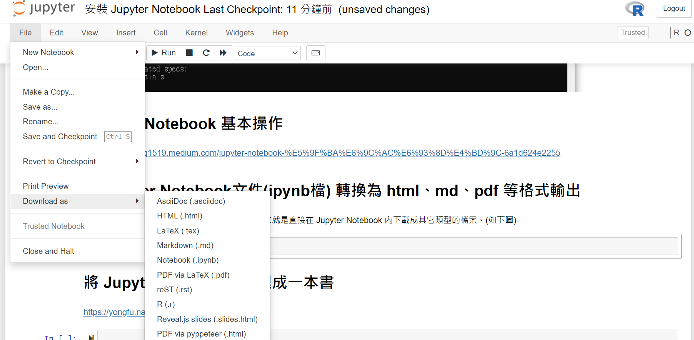

## 安裝前的準備：Python 
開始安裝 Jupyter Notebook 前，需先安裝 Python (Python 3.3及更高版本)。Python 的安裝教學，可以參考Anaconda 3 安裝教學及說明。

# Anaconda 3 安裝教學及說明

https://medium.com/ai-for-k12/anaconda-3-%E5%AE%89%E8%A3%9D%E6%95%99%E5%AD%B8%E5%8F%8A%E8%AA%AA%E6%98%8E-3542d8e6a224

# Jupyter Notebook 使用說明

https://medium.com/ai-for-k12/jupyter-notebook-%E5%AE%8C%E6%95%B4%E4%BB%8B%E7%B4%B9-%E5%AE%89%E8%A3%9D%E5%8F%8A%E4%BD%BF%E7%94%A8%E8%AA%AA%E6%98%8E-846b5432f044

## Jupyter Notebook 上安裝 R 

# Jupyter Notebook 基本操作

https://chienhung1519.medium.com/jupyter-notebook-%E5%9F%BA%E6%9C%AC%E6%93%8D%E4%BD%9C-6a1d624e2255

# 將Jupyter Notebook文件(ipynb檔) 轉換為 html、md、pdf 等格式輸出

> ### 如果要將ipynb檔轉成其它檔案類型，最簡單的方法是直接在 Jupyter Notebook 內下載成其它類型的檔案。 (如下圖) 

### ipynb轉為html格式

 >  選擇 File-> Download as -> HTML(.html)
  

> ### 使用nbconvert將大量ipynb檔轉成html、PDF、 markdown 
https://medium.com/@lin7lic/%E4%BD%BF%E7%94%A8nbconvert%E5%B0%87%E5%A4%A7%E9%87%8Fipynb%E6%AA%94%E8%BD%89%E6%88%90html-pdf-markdown-b147c9a3a5d3

> ### 如何將ipynb轉換為html，md，pdf等格式
https://codertw.com/%E7%A8%8B%E5%BC%8F%E8%AA%9E%E8%A8%80/452713/

### 參考網站:

* 將 Jupyter Notebook 整理成一本書

https://yongfu.name/2019/05/11/jupyter-book.html

